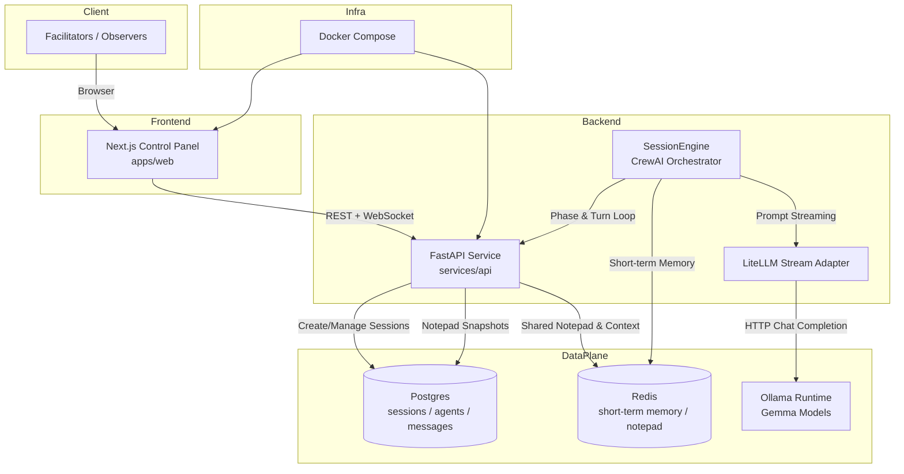

# CrewTalk Architecture & Telemetry Notes

## Component Overview

- **Next.js Control Panel** renders the retro UI for creating sessions, adding agents, managing phases, and reviewing the transcript/notepad. It talks to the backend via REST for setup operations and a WebSocket for live token and status events.
- **FastAPI Service** exposes the public API surface (`/sessions`, `/agents`, `/start`, `/stream`, `/notepad`). It delegates long-running orchestration to an in-memory `SessionEngine` per session.
- **CrewAI SessionEngine** coordinates moderator, participant, and note-taker turns using CrewAI. It pulls short-term memory and shared notepad data from Redis, persists completed turns in Postgres, and dispatches live updates over WebSocket.
- **LiteLLM Adapter** wraps CrewAI’s requests so that all completions flow through LiteLLM’s async streaming API before hitting Ollama.
- **Ollama Runtime** hosts the configured Gemma models and serves generation traffic back to LiteLLM/CrewAI.
- **Postgres** stores durable session metadata, agent rosters, message history, and notepad snapshots.
- **Redis** keeps the low-latency scratchpad (last eight turns per agent) and live notepad content that the WebSocket broadcasts.
- **Docker Compose** ties together the API, web UI, Ollama, Postgres, and Redis services for local development.

## Sentiment & Confidence Telemetry

CrewTalk enriches every committed message with sentiment and confidence scores before persisting to Postgres:

- **Sentiment** is produced by a lightweight keyword heuristic in `SessionEngine._sentiment_score`. Positive and negative token sets are counted, producing a normalized value between `-1.0` (negative) and `1.0` (positive). Messages without matching keywords default to `0.0`.
- **Confidence** combines user-declared confidence (if the agent replies with `Confidence: <value>`) and hedging heuristics. The engine looks for words such as “maybe”, “possibly”, and “unsure”; each hedge lowers the automatically inferred confidence. When the agent returns an explicit numeric value, the engine blends that with the heuristic score for a smoother result.

These metrics are stored alongside each message record (`messages.sentiment`, `messages.confidence`). The web UI displays them under every turn so facilitators can quickly scan emotional tone and the agents’ self-reported certainty throughout the session. Stream events (`message.created`) also include the same fields, allowing downstream consumers to react in real time.
